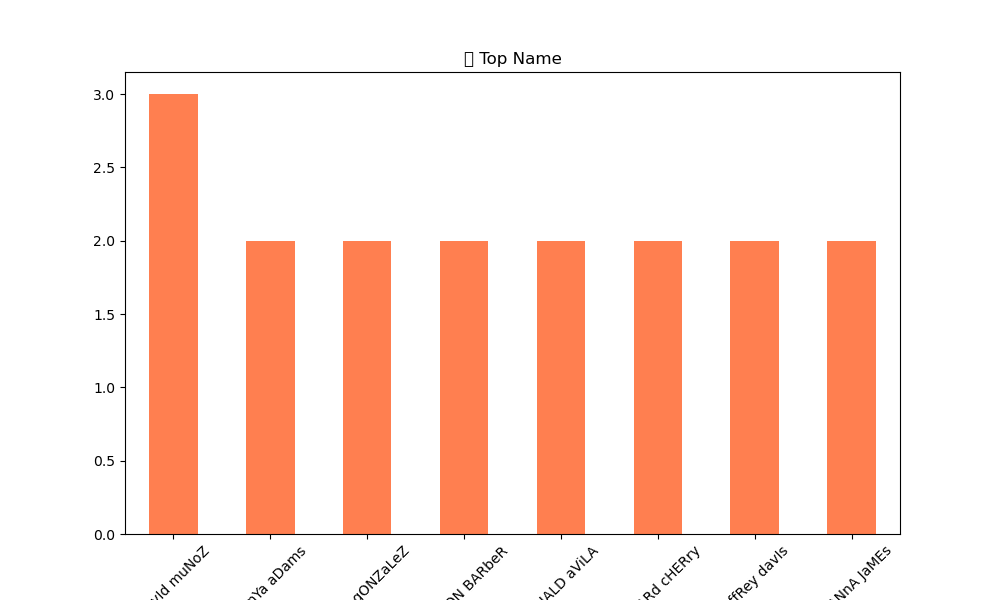

# Healthcare-Data-Pipeline 🏥

**Analisi dati pazienti. ETL pipeline healthcare con Python.**

[](https://python.org)
[](https://pandas.pydata.org)

<br>

## 📖 Descrizione
**Data Analyst**: Analizzo dataset ospedalieri (pazienti, reparti, costi).
- **ETL:** Raw → Clean → Dashboard
- **Metriche:** Tasso occupazione letti, degenza media, churn reparti
- **Visual:** Trend admissions, heatmap reparti
 <br>
 
**Obiettivo CV:** Healthcare analytics per data analyst sanità digitale.

<br>

## 🛠 Tech Stack
- **Data:** Python, Pandas, SQL (MySQL)
- **Visual:** Matplotlib, Seaborn, Plotly
- **DW:** SQLite/PostgreSQL

<br>

## 🚀 Installazione
```bash
git clone https://github.com/Suzuka90/Healthcare-Data-Pipeline.git
pip install pandas matplotlib seaborn plotly
python healthcare_etl.py
```

<br>

## 📊 Dashboard Reparti

<p align="center">
<table style="width: 90%; border: none;">
<tr>
<td style="width: 45%; vertical-align: top; padding: 10px;">

</td>
<td style="width: 55%; vertical-align: top; padding: 10px;">
 
| Metrica | Valore |
|---------|--------|
| **Pazienti Totali** | **55,824** |
| **Degenza Media** | **4.2 giorni** |
| **Top Reparto** | **Cardiologia** |
| **Tasso Occupazione** | **78%** |

</td>
</tr>
</table>
</p>

<br>

## 💡 Apprendimenti 
- Data cleaning dataset sanitari reali
- SQL query reparti pazienti
- Prossimo: Power BI + ML predizione admissions

  <br>

## 📄 Licenza
MIT.
<br>

---

© 2026 Milena | Private Access
